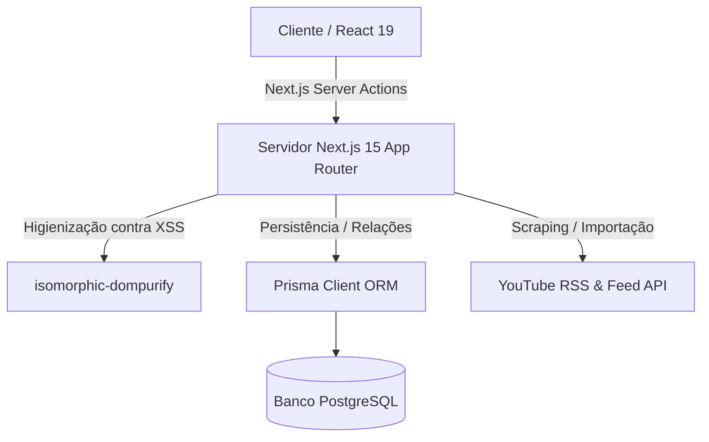

# 🧠 Banco Intelectual & App de Estudos

> Uma plataforma pessoal premium e centralizada para catalogar cursos, gerenciar playlists do YouTube, registrar progresso acadêmico e guardar anotações, hacks, prompts, códigos e ativos digitais em formato de cartões interativos.

---

## 🎨 Galeria & Interface Visual

Abaixo estão representados os locais recomendados para inclusão de capturas de tela das principais visões do sistema:

| Dashboard Geral (Linear Style) | Editor de Cards (Notion/Medium) | Modo Leitura Pública (Obsidian/Arc) |
| :---: | :---: | :---: |
|  |  |  |

---

## 🚀 Principais Funcionalidades

### 📂 Banco Intelectual (Cards & Ativos Digitais)
* **Visualização Premium:** Cards organizados com capas customizadas por cores ou URLs de imagens, com suporte a visualização em Grade (Grid) ou Lista horizontal.
* **Ações em Hover:** Ações rápidas para Fixar (Pin) e Favoritar (Favorite) com atalhos de hover, e menu de contexto de reticências (`...`) para Duplicar, Arquivar, Copiar Link e Excluir.
* **Filtros e Busca Refinada:** Busca instantânea textual e semântica com pílulas e chips interativos para remover filtros ativos de categorias e tags.

### 📚 Cursos & Trilhas
* **Checklist Automatizado:** Geração automática do progresso das aulas e status de conclusão.
* **Estrutura por Módulos:** Criação e ordenação de módulos arrastáveis para estruturar cursos extensos.
* **Materiais de Apoio:** Upload seguro de PDFs, slides e apostilas associados a cada curso, com controle rígido de extensões seguras contra XSS.

### 🎥 Playlists do YouTube (Estudo Guiado)
* **Importação Fácil:** Digite a URL de uma playlist pública do YouTube para importar automaticamente todos os vídeos associados como aulas do curso.
* **Player Integrado:** Assista aos vídeos da playlist sem sair da plataforma, registrando anotações em Markdown sincronizadas por tempo e aulas.
* **Autosave Inteligente:** Sistema de salvamento automático no editor de notas a cada 800ms de inatividade.

---

## 🛠️ Arquitetura do Sistema

O fluxo de dados da aplicação funciona de forma robusta e otimizada por meio de Server Actions e renderização híbrida:



---

## 💻 Pilha Tecnológica

* **Core:** [Next.js 15](https://nextjs.org/) (App Router), [React 19](https://react.dev/), [TypeScript](https://www.typescriptlang.org/)
* **Estilização:** Tailwind CSS v3, Radix UI Primitives, Lucide Icons
* **Banco de Dados:** PostgreSQL, Prisma ORM
* **Segurança:** PBKDF2/scrypt (`node:crypto`), `isomorphic-dompurify` (Sanitização de HTML), cookies de sessão HTTP-Only
* **Testes & Tipos:** Vitest (Testes Unitários), Zod (Validação de Schemas)

---

## ⚙️ Instalação Local e Configuração

### Requisitos Mínimos
* **Node.js:** Versão `20.9` ou superior
* **npm:** Versão `10` ou superior
* **Docker Desktop** (opcional, para inicialização do banco local automática)

### Passo a Passo

1. **Clonar o Repositório:**
   ```bash
   git clone https://github.com/usuario/meu-app-estudos.git
   cd meu-app-estudos
   ```

2. **Instalar Dependências:**
   ```bash
   npm install
   ```

3. **Configuração e Migrations Automáticas:**
   O comando de setup prepara o `.env`, inicializa o banco local PostgreSQL no Docker (porta `54329`), roda as migrations e gera o Prisma Client automaticamente:
   ```bash
   npm run setup
   ```

4. **Executar o Servidor de Desenvolvimento:**
   ```bash
   npm run dev
   ```
   Acesse [http://localhost:3000](http://localhost:3000) no seu navegador.

---

## 🔒 Estratégia de Segurança & Variáveis de Ambiente

As credenciais do banco de dados e segredos da aplicação são mantidos rigidamente fora do controle de versão:

| Arquivo | Finalidade | Versionado? |
| :--- | :--- | :---: |
| `.env.example` | Configuração padrão para ambiente de desenvolvimento local (Docker) | **Sim** |
| `.env` | Credenciais ativas da sua máquina local | **Não** |
| `.env.production.example` | Template de configuração para ambientes de produção (ex. Supabase/Neon) | **Sim** |

---

## 📈 Scripts Disponíveis

* `npm run dev` — Inicia o servidor de desenvolvimento.
* `npm run build` — Compila a aplicação para produção (Gera Prisma Client e build Next.js).
* `npm run test` — Executa todos os testes unitários via Vitest.
* `npm run db:studio` — Abre o Prisma Studio para gerenciar dados do banco local.
* `npm run db:migrate` — Gera e aplica novas migrations do Prisma em desenvolvimento.
* `npm run db:deploy` — Aplica migrations existentes no ambiente de produção.
* `npm run db:reset` — Limpa o banco de dados e executa as migrations do zero.

---

## 📂 Estrutura de Pastas

```text
scripts/
  setup-local.mjs  # Automação de setup inicial do contêiner e rede local
prisma/
  migrations/      # Histórico de alterações do banco de dados PostgreSQL
  schema.prisma    # Modelagem e relações Prisma ORM
src/
  actions/         # Server Actions (Cadastro, Cursos, Módulos, Ativos Digitais)
  app/             # Rotas de página do Next.js (App Router)
  components/      # Componentes UI (Sidebar, Topbar, Editores, Cards)
  lib/             # Utilitários, sanitizadores, autenticação e Zod schemas
docker-compose.yml # Definição do contêiner PostgreSQL local
```

---

## 🛡️ Licença

Este projeto é de uso pessoal e privado. Todos os direitos reservados.
